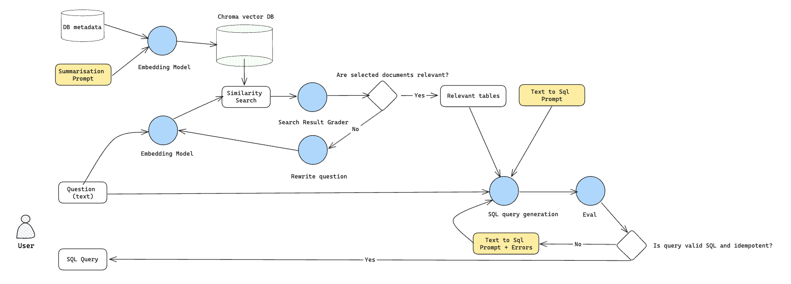

# Text to SQL

This repo contains code to deploy a text-to-SQL LLM application to AWS lambda.

### Text2SQL Model:

A LangChain based corrective RAG graph.
(Model is available for experimentation in cohere.ipynb notebook.)

Features:

- Cohere commandR used throughout due to low cost and decent performance
- Embeddings stored in ChromaDB
- Grading of document relevance and automated query rewrite to be more applicable to vector similarity search
- LLM evals and automated re-generation
- Monitoring via LangSmith

### Text2SQL Lambda Service

An API Gateway + Lambda based REST service that can connect to any front end application and return valid SQL queries in response to a user question.

## Next steps:

- Retry limits at conditional edges
- Errors from evals fed back to generation
- Async embedding and storage in AWS Aurora/ OpenSearch
- Human-in-the-loop & chat history with DynamoDB
- Add pytest to CI
- Finetune Mistral on Spider data (Sagemaker)

## Prerequisites

- nodejs 18+
- Python 3.9+
- aws-cdk toolkit (`npm install -g aws-cdk`)
- AWS account configured with credentials (https://docs.aws.amazon.com/cdk/v2/guide/getting_started.html#getting_started_prerequisites)
- openai api key saved in Secrets Manager in your AWS Account
  - Expected secret name is `api-keys`
  - keys is expected to be stored with format `OPENAI_API_KEY`: `value`
- conda (https://conda.io/projects/conda/en/latest/user-guide/install/index.html)
